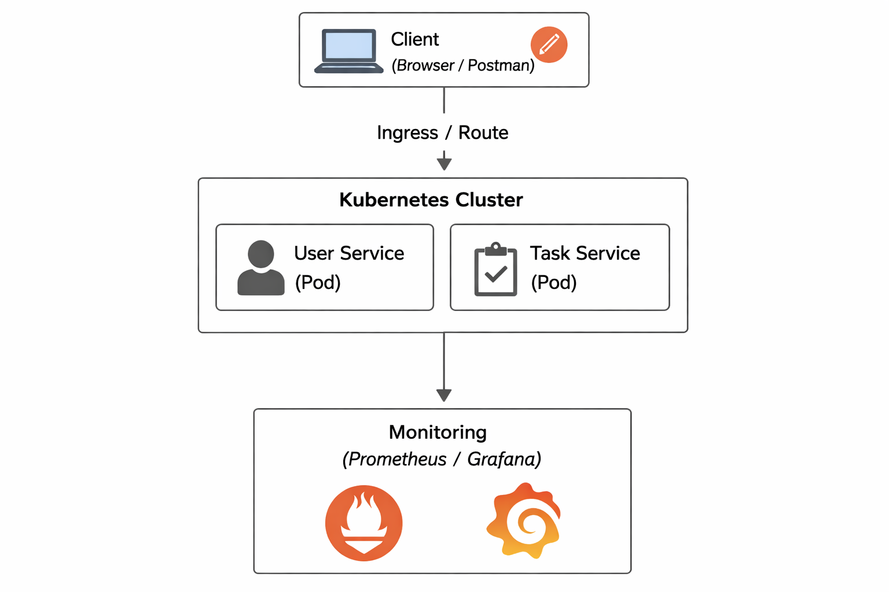

# 🗂 Task Manager Microservices Project

## 📌 Project Overview
This project is a **microservices-based Task Manager application** developed for academic purposes.  
It demonstrates **backend microservices**, **containerization**, and **Kubernetes orchestration**.

The system is composed of two main services:
- **User Service**
- **Task Service**

Each service is independently deployable and containerized

---

## 🧱 Architecture Overview
- Backend built using **Spring Boot**
- Services containerized using **Docker**
- Orchestrated using **Kubernetes (Minikube)**
- Health monitoring via **Spring Boot Actuator**

---

## 🧩 Microservices Description

### 👤 User Service
Responsible for managing users.

**Responsibilities:**
- Register user
- Login user
- Health check

**Default Port:** `8080`

---

### ✅ Task Service
Responsible for managing tasks related to users.

**Responsibilities:**
- Create task
- Update task
- Delete task
- List tasks by user
- Health check

**Default Port:** `8081`

---

## 🔌 API Contracts

### 🧍 User Service API

| Method | Endpoint | Description | Request Body | Response |
|------|---------|------------|--------------|----------|
| POST | `/users/register` | Register a new user | `{ "username": "string", "password": "string" }` | User object |
| POST | `/users/login` | Login user | `{ "username": "string", "password": "string" }` | Auth message |
| GET | `/actuator/health` | Health check | — | `{ "status": "UP" }` |

---

## 🏗 Architecture Diagram



This diagram shows the overall system architecture, including the client,
Kubernetes cluster, microservices (User Service and Task Service),
Ingress routing, and monitoring using Prometheus and Grafana.


### 📝 Task Service API

| Method | Endpoint | Description | Request Body | Response |
|------|---------|------------|--------------|----------|
| POST | `/tasks` | Create task | `{ "title": "string", "userId": number }` | Task object |
| PUT | `/tasks/{id}` | Update task | `{ "title": "string" }` | Updated task |
| DELETE | `/tasks/{id}` | Delete task | — | Success message |
| GET | `/tasks?userId={id}` | List tasks by user | — | Task list |
| GET | `/actuator/health` | Health check | — | `{ "status": "UP" }` |

---

## 🐳 Docker

Each service has its own `Dockerfile`.

### Build Image
```bash
docker build -t user-service .
docker build -t task-service .
